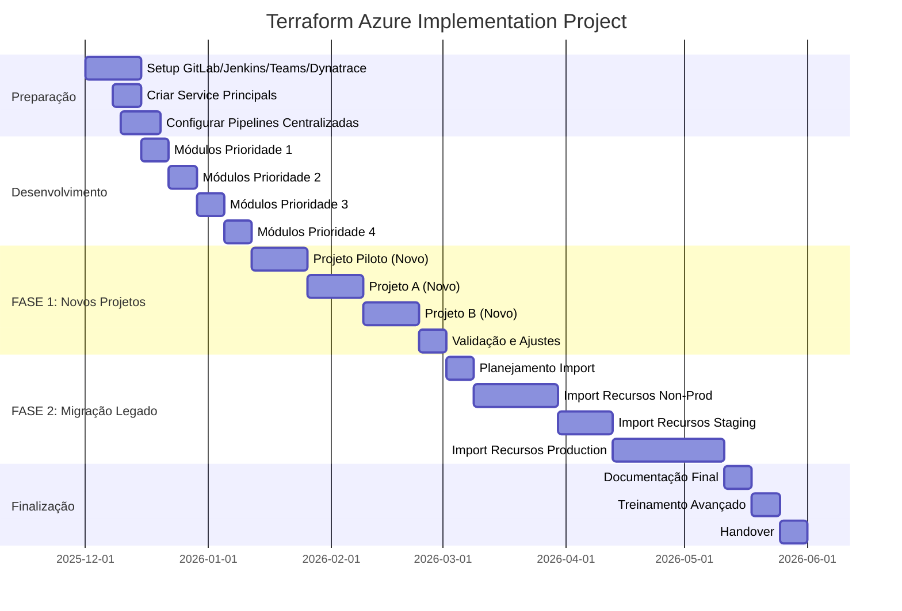

# Plano de Arquitetura Terraform para Azure
## Projeto de Modernização de Infraestrutura como Código

**Data:** 30 de Novembro de 2025  
**Autor:** Arquiteto Cloud Azure  
**Versão:** 2.0

---

## 1. Sumário Executivo

Este documento apresenta um plano detalhado para implementação de Infrastructure as Code (IaC) utilizando Terraform em um ambiente Azure legado. O projeto visa modernizar a gestão de infraestrutura, implementando módulos reutilizáveis e versionados, com CI/CD robusto utilizando GitLab e Jenkins.

### 1.1 Objetivos Principais

- **Modularização**: Criar módulos Terraform reutilizáveis para recursos mais utilizados
- **Versionamento**: Implementar controle de versão semântico para todos os módulos
- **Automação**: Estabelecer pipelines CI/CD parametrizadas e reutilizáveis para múltiplos projetos
- **Governança**: Implementar aprovações multi-nível e melhores práticas de segurança
- **Observabilidade**: Integração com Teams (notificações) e Dynatrace (métricas)
- **Abordagem Faseada**: Priorizar novos projetos primeiro, migração de recursos legados em fase posterior

### 1.2 Benefícios Esperados

- Redução de tempo de provisionamento em até 70%
- Padronização de recursos e configurações
- Rastreabilidade completa de mudanças
- Redução de erros humanos
- Facilidade de rollback e disaster recovery
- Documentação como código

---

## 2. Arquitetura Proposta

### 2.1 Visão Geral da Arquitetura

```
┌─────────────────────────────────────────────────────────────────────────┐
│                         GitLab Repositories                             │
│  ┌──────────────────┐  ┌──────────────────────────────────────────┐    │
│  │  Terraform       │  │  Project Repositories (Multiple)         │    │
│  │  Modules         │  │  - terraform-project-a                   │    │
│  │  (Monorepo)      │  │  - terraform-project-b                   │    │
│  │  (versioned)     │  │  - terraform-project-c                   │    │
│  └──────────────────┘  │  Each with: dev/test/staging/prod configs│    │
│                        └──────────────────────────────────────────┘    │
└─────────────────────────────────────────────────────────────────────────┘
                                      │
                                      ▼
┌─────────────────────────────────────────────────────────────────────────┐
│                   Jenkins - Centralized Pipelines (4)                   │
│  ┌────────────────────────────────────────────────────────────────┐    │
│  │ 1. terraform-deploy-pipeline (Shared Library)                  │    │
│  │    - Parametrized: PROJECT_NAME, ENVIRONMENT, ACTION           │    │
│  │    - Multi-approval: DevOps Team + Security Team (prod)        │    │
│  │                                                                 │    │
│  │ 2. terraform-validation-pipeline (PR/MR validation)            │    │
│  │    - Auto-triggered on merge requests                          │    │
│  │                                                                 │    │
│  │ 3. terraform-drift-detection-pipeline (Scheduled)              │    │
│  │    - Runs every 4 hours across all projects                    │    │
│  │                                                                 │    │
│  │ 4. terraform-modules-validation-pipeline (Module Quality)      │    │
│  │    - Auto-triggered on module repo changes                     │    │
│  │    - Validates modules + security + tests                      │    │
│  └────────────────────────────────────────────────────────────────┘    │
│                                                                         │
│  Integrations:                                                          │
│  • Microsoft Teams (Notifications)                                      │
│  • Dynatrace (Metrics & Observability)                                  │
└─────────────────────────────────────────────────────────────────────────┘
                                      │
                                      ▼
┌─────────────────────────────────────────────────────────────────────────┐
│                      Azure Cloud Platform                               │
│  ┌────────────────────┐              ┌────────────────────┐            │
│  │  Non-Prod Env      │              │  Prod Env          │            │
│  │  - Development     │              │  - Production      │            │
│  │  - Testing         │              │  - DR              │            │
│  │  - Staging         │              │                    │            │
│  └────────────────────┘              └────────────────────┘            │
└─────────────────────────────────────────────────────────────────────────┘
```

### 2.2 Estrutura de Repositórios

#### Repositório 1: terraform-azure-modules

Contém módulos Terraform reutilizáveis e versionados.

```
terraform-azure-modules/
├── README.md
├── .gitignore
├── .gitlab-ci.yml
├── modules/
│   ├── virtual-machine/
│   │   ├── versions.tf
│   │   ├── main.tf
│   │   ├── variables.tf
│   │   ├── outputs.tf
│   │   ├── README.md
│   │   ├── examples/
│   │   └── tests/
│   ├── storage-account/
│   │   ├── versions.tf
│   │   ├── main.tf
│   │   ├── variables.tf
│   │   ├── outputs.tf
│   │   ├── README.md
│   │   ├── examples/
│   │   └── tests/
│   ├── virtual-network/
│   │   ├── versions.tf
│   │   ├── main.tf
│   │   ├── variables.tf
│   │   ├── outputs.tf
│   │   ├── README.md
│   │   ├── examples/
│   │   └── tests/
│   ├── app-service/
│   │   ├── versions.tf
│   │   ├── main.tf
│   │   ├── variables.tf
│   │   ├── outputs.tf
│   │   ├── README.md
│   │   ├── examples/
│   │   └── tests/
│   ├── sql-database/
│   │   ├── versions.tf
│   │   ├── main.tf
│   │   ├── variables.tf
│   │   ├── outputs.tf
│   │   ├── README.md
│   │   ├── examples/
│   │   └── tests/
│   ├── key-vault/
│   │   ├── versions.tf
│   │   ├── main.tf
│   │   ├── variables.tf
│   │   ├── outputs.tf
│   │   ├── README.md
│   │   ├── examples/
│   │   └── tests/
│   ├── aks-cluster/
│   │   ├── versions.tf
│   │   ├── main.tf
│   │   ├── variables.tf
│   │   ├── outputs.tf
│   │   ├── README.md
│   │   ├── examples/
│   │   └── tests/
│   └── monitoring/
│       ├── versions.tf
│       ├── main.tf
│       ├── variables.tf
│       ├── outputs.tf
│       ├── README.md
│       ├── examples/
│       └── tests/
├── scripts/
│   ├── validate-modules.sh
│   ├── test-modules.sh
│   └── release.sh
└── docs/
    ├── module-development-guide.md
    ├── versioning-strategy.md
    └── best-practices.md
```

#### Repositório 2: terraform-azure-infrastructure

Contém as configurações de infraestrutura para cada ambiente.

```
terraform-azure-infrastructure/
├── README.md
├── .gitignore
├── Jenkinsfile
├── environments/
│   ├── non-prod/
│   │   ├── development/
│   │   │   ├── backend.tf
│   │   │   ├── main.tf
│   │   │   ├── variables.tf
│   │   │   ├── outputs.tf
│   │   │   ├── terraform.tfvars
│   │   │   └── versions.tf
│   │   ├── testing/
│   │   │   ├── backend.tf
│   │   │   ├── main.tf
│   │   │   ├── variables.tf
│   │   │   ├── outputs.tf
│   │   │   ├── terraform.tfvars
│   │   │   └── versions.tf
│   │   └── staging/
│   │       ├── backend.tf
│   │       ├── main.tf
│   │       ├── variables.tf
│   │       ├── outputs.tf
│   │       ├── terraform.tfvars
│   │       └── versions.tf
│   └── prod/
│       ├── production/
│       │   ├── backend.tf
│       │   ├── main.tf
│       │   ├── variables.tf
│       │   ├── outputs.tf
│       │   ├── terraform.tfvars
│       │   └── versions.tf
│       └── dr/
│           ├── backend.tf
│           ├── main.tf
│           ├── variables.tf
│           ├── outputs.tf
│           ├── terraform.tfvars
│           └── versions.tf
├── global/
│   ├── networking/
│   ├── security/
│   └── monitoring/
├── scripts/
│   ├── terraform-init.sh
│   ├── terraform-plan.sh
│   ├── terraform-apply.sh
│   └── terraform-destroy.sh
└── docs/
    ├── deployment-guide.md
    ├── runbook.md
    └── architecture-diagrams/
```

---

## 3. Estratégia de Pipelines Centralizadas e Decisões Arquiteturais

### 3.1 Pipeline Centralizada vs Pipeline por Projeto

**✅ DECISÃO: Usar 4 Pipelines Centralizadas (Recomendado)**

#### Justificativa

Ao invés de criar uma pipeline para cada projeto, vamos usar **4 pipelines parametrizadas e reutilizáveis** que atendem todos os projetos e módulos. Esta abordagem oferece:

**Vantagens:**
- ✅ Manutenção centralizada e simplificada
- ✅ Padronização garantida em todos os projetos
- ✅ Menos duplicação de código
- ✅ Atualizações aplicadas automaticamente a todos os projetos
- ✅ Troubleshooting mais fácil (um único ponto de verdade)
- ✅ Visibilidade unificada no Jenkins
- ✅ Métricas consolidadas para Dynatrace

**Desvantagens:**
- ⚠️ Complexidade inicial maior na parametrização
- ⚠️ Testes mais críticos (mudanças afetam todos os projetos)
- ⚠️ Necessidade de versionamento da própria pipeline

**Mitigação das Desvantagens:**
- Usar Jenkins Shared Library para versionamento
- Testes rigorosos em ambiente de desenvolvimento
- Rollback strategy para pipelines

#### As 4 Pipelines Centralizadas

> **📁 Nota:** Os códigos completos das pipelines estão disponíveis no diretório `pipelines/` para facilitar a leitura e manutenção.

##### 1. terraform-deploy-pipeline

**Arquivo:** [`pipelines/terraform-deploy-pipeline.groovy`](pipelines/terraform-deploy-pipeline.groovy)

Pipeline principal para deploy e destroy de recursos.

**Características:**
- ✅ Parametrizada por projeto, ambiente e ação
- ✅ Multi-aprovação (DevOps + Security para prod)
- ✅ Notificações Teams + Dynatrace
- ✅ Security scanning (TFSec + Checkov)
- ✅ Post-deployment tests

**Parâmetros:**
- `PROJECT_NAME`: Nome do projeto
- `ENVIRONMENT`: development | testing | staging | production
- `ACTION`: plan | apply | destroy
- `GIT_BRANCH`: Branch do repositório (default: main)

**Stages principais:**
1. Initialize → Notificações iniciais
2. Checkout → Clone do repositório
3. Validate → Validação de sintaxe
4. Security Scan → TFSec + Checkov
5. Terraform Plan → Geração do plano
6. Approval DevOps → Primeira aprovação
7. Approval Security → Segunda aprovação (prod only)
8. Terraform Apply/Destroy → Execução
9. Post-Deployment Tests → Validação

<details>
<summary>📄 Ver código completo</summary>

```groovy
// vars/terraformDeploy.groovy (Jenkins Shared Library)
def call(Map config = [:]) {
    pipeline {
        agent {
            label 'terraform-agent'
        }
        
        parameters {
            string(
                name: 'PROJECT_NAME',
                description: 'Nome do projeto (ex: project-a, project-b)'
            )
            choice(
                name: 'ENVIRONMENT',
                choices: ['development', 'testing', 'staging', 'production'],
                description: 'Ambiente alvo'
            )
            choice(
                name: 'ACTION',
                choices: ['plan', 'apply', 'destroy'],
                description: 'Ação Terraform'
            )
            string(
                name: 'GIT_BRANCH',
                defaultValue: 'main',
                description: 'Branch do repositório'
            )
        }
        
        environment {
            PROJECT_DISPLAY_NAME = "${params.PROJECT_NAME}-${params.ENVIRONMENT}"
            WORKSPACE_PATH = "environments/${params.ENVIRONMENT}"
            ARM_CLIENT_ID = credentials('azure-client-id')
            ARM_CLIENT_SECRET = credentials('azure-client-secret')
            ARM_SUBSCRIPTION_ID = credentials('azure-subscription-id')
            ARM_TENANT_ID = credentials('azure-tenant-id')
        }
        
        stages {
            stage('Initialize') {
                steps {
                    script {
                        echo "🚀 Starting deployment for ${PROJECT_DISPLAY_NAME}"
                        
                        // Send Teams notification
                        sendTeamsNotification(
                            status: 'STARTED',
                            projectName: params.PROJECT_NAME,
                            environment: params.ENVIRONMENT,
                            action: params.ACTION,
                            triggeredBy: env.BUILD_USER
                        )
                        
                        // Send Dynatrace event
                        sendDynatraceEvent(
                            eventType: 'CUSTOM_DEPLOYMENT',
                            title: "Terraform ${params.ACTION} started",
                            source: 'Jenkins',
                            customProperties: [
                                project: params.PROJECT_NAME,
                                environment: params.ENVIRONMENT,
                                action: params.ACTION
                            ]
                        )
                    }
                }
            }
            
            stage('Checkout') {
                steps {
                    script {
                        echo "📦 Checking out ${params.PROJECT_NAME} from branch ${params.GIT_BRANCH}"
                        
                        checkout([
                            $class: 'GitSCM',
                            branches: [[name: params.GIT_BRANCH]],
                            userRemoteConfigs: [[
                                url: "https://gitlab.com/org/terraform-${params.PROJECT_NAME}.git",
                                credentialsId: 'gitlab-credentials'
                            ]]
                        ])
                    }
                }
            }
            
            stage('Validate') {
                steps {
                    dir("${WORKSPACE_PATH}") {
                        sh """
                            echo "✓ Validating Terraform code for ${PROJECT_DISPLAY_NAME}"
                            terraform fmt -check -recursive
                            terraform init -backend=false
                            terraform validate
                        """
                    }
                }
            }
            
            stage('Security Scan') {
                parallel {
                    stage('TFSec') {
                        steps {
                            dir("${WORKSPACE_PATH}") {
                                sh """
                                    tfsec . --format junit --out tfsec-report-${PROJECT_DISPLAY_NAME}.xml
                                """
                            }
                        }
                    }
                    stage('Checkov') {
                        steps {
                            dir("${WORKSPACE_PATH}") {
                                sh """
                                    checkov -d . --framework terraform \\
                                        --output junitxml --output-file checkov-report-${PROJECT_DISPLAY_NAME}.xml
                                """
                            }
                        }
                    }
                }
            }
            
            stage('Terraform Init') {
                steps {
                    dir("${WORKSPACE_PATH}") {
                        sh """
                            echo "🔧 Initializing Terraform for ${PROJECT_DISPLAY_NAME}"
                            terraform init -upgrade
                        """
                    }
                }
            }
            
            stage('Terraform Plan') {
                steps {
                    dir("${WORKSPACE_PATH}") {
                        script {
                            def planExitCode = sh(
                                script: """
                                    terraform plan \\
                                        -out=tfplan-${PROJECT_DISPLAY_NAME} \\
                                        -var-file=terraform.tfvars \\
                                        -detailed-exitcode
                                """,
                                returnStatus: true
                            )
                            
                            if (planExitCode == 2) {
                                echo "⚠️ Changes detected for ${PROJECT_DISPLAY_NAME}"
                            } else if (planExitCode == 0) {
                                echo "✓ No changes required for ${PROJECT_DISPLAY_NAME}"
                            } else {
                                error "❌ Terraform plan failed for ${PROJECT_DISPLAY_NAME}"
                            }
                            
                            sh "terraform show -json tfplan-${PROJECT_DISPLAY_NAME} > tfplan-${PROJECT_DISPLAY_NAME}.json"
                        }
                    }
                }
            }
            
            stage('Approval - DevOps Team') {
                when {
                    expression { 
                        params.ACTION == 'apply' || params.ACTION == 'destroy'
                    }
                }
                steps {
                    script {
                        sendTeamsNotification(
                            status: 'PENDING_APPROVAL',
                            projectName: params.PROJECT_NAME,
                            environment: params.ENVIRONMENT,
                            action: params.ACTION,
                            approvalLevel: 'DevOps Team'
                        )
                        
                        timeout(time: 2, unit: 'HOURS') {
                            input(
                                id: 'DevOpsApproval',
                                message: "Approve ${params.ACTION} for ${PROJECT_DISPLAY_NAME}?",
                                submitter: 'devops-team',
                                parameters: [
                                    text(
                                        name: 'APPROVAL_COMMENT',
                                        description: 'Comments for this approval'
                                    )
                                ]
                            )
                        }
                    }
                }
            }
            
            stage('Approval - Security Team') {
                when {
                    expression { 
                        (params.ACTION == 'apply' || params.ACTION == 'destroy') && 
                        params.ENVIRONMENT == 'production'
                    }
                }
                steps {
                    script {
                        sendTeamsNotification(
                            status: 'PENDING_APPROVAL',
                            projectName: params.PROJECT_NAME,
                            environment: params.ENVIRONMENT,
                            action: params.ACTION,
                            approvalLevel: 'Security Team (Production)'
                        )
                        
                        timeout(time: 4, unit: 'HOURS') {
                            input(
                                id: 'SecurityApproval',
                                message: "Security Team: Approve ${params.ACTION} for ${PROJECT_DISPLAY_NAME} (PRODUCTION)?",
                                submitter: 'security-team',
                                parameters: [
                                    text(
                                        name: 'SECURITY_APPROVAL_COMMENT',
                                        description: 'Security review comments'
                                    )
                                ]
                            )
                        }
                    }
                }
            }
            
            stage('Terraform Apply') {
                when {
                    expression { params.ACTION == 'apply' }
                }
                steps {
                    dir("${WORKSPACE_PATH}") {
                        sh """
                            echo "🚀 Applying changes for ${PROJECT_DISPLAY_NAME}"
                            terraform apply tfplan-${PROJECT_DISPLAY_NAME}
                        """
                    }
                }
            }
            
            stage('Terraform Destroy') {
                when {
                    expression { params.ACTION == 'destroy' }
                }
                steps {
                    dir("${WORKSPACE_PATH}") {
                        sh """
                            echo "🗑️ Destroying resources for ${PROJECT_DISPLAY_NAME}"
                            terraform destroy -var-file=terraform.tfvars -auto-approve
                        """
                    }
                }
            }
            
            stage('Post-Deployment Tests') {
                when {
                    expression { params.ACTION == 'apply' }
                }
                steps {
                    sh """
                        echo "🧪 Running post-deployment tests for ${PROJECT_DISPLAY_NAME}"
                        ./scripts/post-deployment-tests.sh ${params.PROJECT_NAME} ${params.ENVIRONMENT}
                    """
                }
            }
        }
        
        post {
            success {
                script {
                    sendTeamsNotification(
                        status: 'SUCCESS',
                        projectName: params.PROJECT_NAME,
                        environment: params.ENVIRONMENT,
                        action: params.ACTION,
                        buildUrl: env.BUILD_URL,
                        duration: currentBuild.durationString
                    )
                    
                    sendDynatraceEvent(
                        eventType: 'CUSTOM_DEPLOYMENT',
                        title: "Terraform ${params.ACTION} completed successfully",
                        source: 'Jenkins',
                        customProperties: [
                            project: params.PROJECT_NAME,
                            environment: params.ENVIRONMENT,
                            action: params.ACTION,
                            duration: currentBuild.duration,
                            status: 'SUCCESS'
                        ]
                    )
                }
            }
            
            failure {
                script {
                    sendTeamsNotification(
                        status: 'FAILURE',
                        projectName: params.PROJECT_NAME,
                        environment: params.ENVIRONMENT,
                        action: params.ACTION,
                        buildUrl: env.BUILD_URL,
                        errorLog: currentBuild.rawBuild.getLog(50).join('\n')
                    )
                    
                    sendDynatraceEvent(
                        eventType: 'CUSTOM_DEPLOYMENT',
                        title: "Terraform ${params.ACTION} failed",
                        source: 'Jenkins',
                        customProperties: [
                            project: params.PROJECT_NAME,
                            environment: params.ENVIRONMENT,
                            action: params.ACTION,
                            status: 'FAILURE'
                        ]
                    )
                }
            }
            
            always {
                archiveArtifacts artifacts: "**/tfplan-${PROJECT_DISPLAY_NAME}.json", allowEmptyArchive: true
                junit "**/tfsec-report-${PROJECT_DISPLAY_NAME}.xml, **/checkov-report-${PROJECT_DISPLAY_NAME}.xml"
                cleanWs()
            }
        }
    }
}
```

##### 2. terraform-validation-pipeline

Pipeline para validação automática em Pull Requests / Merge Requests.

```groovy
// vars/terraformValidation.groovy (Jenkins Shared Library)
def call(Map config = [:]) {
    pipeline {
        agent {
            label 'terraform-agent'
        }
        
        triggers {
            gitlab(
                triggerOnMergeRequest: true,
                branchFilterType: 'All'
            )
        }
        
        environment {
            PROJECT_NAME = sh(
                script: "basename \${GIT_URL} .git | sed 's/terraform-//'",
                returnStdout: true
            ).trim()
        }
        
        stages {
            stage('Validate All Environments') {
                parallel {
                    stage('Development') {
                        steps {
                            validateEnvironment('development')
                        }
                    }
                    stage('Testing') {
                        steps {
                            validateEnvironment('testing')
                        }
                    }
                    stage('Staging') {
                        steps {
                            validateEnvironment('staging')
                        }
                    }
                    stage('Production') {
                        steps {
                            validateEnvironment('production')
                        }
                    }
                }
            }
        }
        
        post {
            success {
                updateGitlabCommitStatus name: 'terraform-validation', state: 'success'
                addGitLabMRComment comment: "✅ Terraform validation passed for all environments"
            }
            failure {
                updateGitlabCommitStatus name: 'terraform-validation', state: 'failed'
                addGitLabMRComment comment: "❌ Terraform validation failed. Check build logs."
            }
        }
    }
}

def validateEnvironment(String env) {
    dir("environments/${env}") {
        sh """
            terraform fmt -check
            terraform init -backend=false
            terraform validate
            tfsec .
        """
    }
}
```

##### 3. terraform-drift-detection-pipeline

Pipeline agendada para detectar drift em todos os projetos.

##### 4. terraform-modules-validation-pipeline

Pipeline para validação e testes dos módulos Terraform no monorepo.

```groovy
// vars/terraformDriftDetection.groovy (Jenkins Shared Library)
def call(Map config = [:]) {
    pipeline {
        agent {
            label 'terraform-agent'
        }
        
        triggers {
            cron('H */4 * * *')  // Every 4 hours
        }
        
        stages {
            stage('Detect Drift All Projects') {
                steps {
                    script {
                        def projects = ['project-a', 'project-b', 'project-c']
                        def environments = ['development', 'testing', 'staging', 'production']
                        def driftDetected = []
                        
                        projects.each { project ->
                            environments.each { env ->
                                echo "🔍 Checking drift for ${project}-${env}"
                                
                                try {
                                    checkout([
                                        $class: 'GitSCM',
                                        branches: [[name: 'main']],
                                        userRemoteConfigs: [[
                                            url: "https://gitlab.com/org/terraform-${project}.git"
                                        ]]
                                    ])
                                    
                                    dir("environments/${env}") {
                                        sh 'terraform init'
                                        
                                        def exitCode = sh(
                                            script: 'terraform plan -detailed-exitcode',
                                            returnStatus: true
                                        )
                                        
                                        if (exitCode == 2) {
                                            driftDetected.add("${project}-${env}")
                                            echo "⚠️ DRIFT DETECTED: ${project}-${env}"
                                            
                                            sendTeamsNotification(
                                                status: 'DRIFT_DETECTED',
                                                projectName: project,
                                                environment: env,
                                                buildUrl: env.BUILD_URL
                                            )
                                            
                                            sendDynatraceEvent(
                                                eventType: 'CUSTOM_INFO',
                                                title: 'Terraform Drift Detected',
                                                source: 'Jenkins',
                                                customProperties: [
                                                    project: project,
                                                    environment: env
                                                ]
                                            )
                                        }
                                    }
                                } catch (Exception e) {
                                    echo "❌ Error checking drift for ${project}-${env}: ${e.message}"
                                }
                            }
                        }
                        
                        if (driftDetected.size() > 0) {
                            echo "📊 Drift detected in: ${driftDetected.join(', ')}"
                        } else {
                            echo "✅ No drift detected in any project"
                        }
                    }
                }
            }
        }
    }
}
```

##### 4. terraform-modules-validation-pipeline

Pipeline para validação e testes dos módulos Terraform no monorepo.

```groovy
// vars/terraformModulesValidation.groovy (Jenkins Shared Library)
def call(Map config = [:]) {
    pipeline {
        agent {
            label 'terraform-agent'
        }
        
        triggers {
            gitlab(
                triggerOnPush: true,
                triggerOnMergeRequest: true,
                branchFilterType: 'All'
            )
        }
        
        environment {
            MODULE_REPO = 'terraform-azure-modules'
        }
        
        stages {
            stage('Checkout') {
                steps {
                    checkout scm
                }
            }
            
            stage('Detect Changed Modules') {
                steps {
                    script {
                        // Get list of changed modules
                        def changedModules = sh(
                            script: """
                                git diff --name-only HEAD~1 HEAD | grep '^modules/' | cut -d/ -f1-3 | sort -u
                            """,
                            returnStdout: true
                        ).trim().split('\n')
                        
                        env.CHANGED_MODULES = changedModules.join(',')
                        echo "📦 Changed modules: ${env.CHANGED_MODULES}"
                    }
                }
            }
            
            stage('Validate All Modules') {
                steps {
                    script {
                        def modules = sh(
                            script: 'find modules -name "main.tf" -exec dirname {} \\;',
                            returnStdout: true
                        ).trim().split('\n')
                        
                        def validationResults = [:]
                        
                        modules.each { module ->
                            echo "🔍 Validating module: ${module}"
                            
                            try {
                                dir(module) {
                                    // Format check
                                    sh 'terraform fmt -check -recursive'
                                    
                                    // Initialize
                                    sh 'terraform init -backend=false'
                                    
                                    // Validate
                                    sh 'terraform validate'
                                    
                                    // Documentation check
                                    if (!fileExists('README.md')) {
                                        error "Missing README.md in ${module}"
                                    }
                                    
                                    if (!fileExists('examples')) {
                                        echo "⚠️ Warning: No examples directory in ${module}"
                                    }
                                    
                                    validationResults[module] = 'PASSED'
                                    echo "✅ ${module} validation passed"
                                }
                            } catch (Exception e) {
                                validationResults[module] = 'FAILED'
                                echo "❌ ${module} validation failed: ${e.message}"
                                currentBuild.result = 'FAILURE'
                            }
                        }
                        
                        // Summary
                        def passed = validationResults.count { it.value == 'PASSED' }
                        def failed = validationResults.count { it.value == 'FAILED' }
                        echo "📊 Validation Summary: ${passed} passed, ${failed} failed"
                    }
                }
            }
            
            stage('Security Scan Modules') {
                parallel {
                    stage('TFSec All Modules') {
                        steps {
                            sh """
                                tfsec modules/ \\
                                    --format junit \\
                                    --out tfsec-modules-report.xml \\
                                    --minimum-severity MEDIUM
                            """
                        }
                    }
                    stage('Checkov All Modules') {
                        steps {
                            sh """
                                checkov -d modules/ \\
                                    --framework terraform \\
                                    --output junitxml \\
                                    --output-file checkov-modules-report.xml
                            """
                        }
                    }
                }
            }
            
            stage('Run Module Tests') {
                when {
                    expression { env.CHANGED_MODULES != '' }
                }
                steps {
                    script {
                        def changedModules = env.CHANGED_MODULES.split(',')
                        
                        changedModules.each { module ->
                            if (fileExists("${module}/tests")) {
                                echo "🧪 Running tests for ${module}"
                                dir("${module}/tests") {
                                    // Run Terratest if exists
                                    if (fileExists('go.mod')) {
                                        sh 'go test -v -timeout 30m'
                                    }
                                    
                                    // Run example validation
                                    dir('../examples') {
                                        def examples = sh(
                                            script: 'find . -maxdepth 1 -type d | tail -n +2',
                                            returnStdout: true
                                        ).trim().split('\n')
                                        
                                        examples.each { example ->
                                            dir(example) {
                                                sh 'terraform init'
                                                sh 'terraform validate'
                                                sh 'terraform plan'
                                            }
                                        }
                                    }
                                }
                            }
                        }
                    }
                }
            }
            
            stage('Generate Module Catalog') {
                steps {
                    sh """
                        echo '# Terraform Azure Modules Catalog' > MODULE_CATALOG.md
                        echo '' >> MODULE_CATALOG.md
                        echo 'Auto-generated on: \$(date)' >> MODULE_CATALOG.md
                        echo '' >> MODULE_CATALOG.md
                        
                        find modules -name "main.tf" -exec dirname {} \\; | sort | while read module; do
                            echo "## \${module}" >> MODULE_CATALOG.md
                            if [ -f "\${module}/README.md" ]; then
                                head -n 5 "\${module}/README.md" >> MODULE_CATALOG.md
                            fi
                            echo '' >> MODULE_CATALOG.md
                        done
                    """
                    archiveArtifacts artifacts: 'MODULE_CATALOG.md'
                }
            }
            
            stage('Version Check') {
                when {
                    branch 'main'
                }
                steps {
                    script {
                        // Check if version tags are properly formatted
                        def tags = sh(
                            script: 'git tag -l',
                            returnStdout: true
                        ).trim()
                        
                        if (tags) {
                            echo "📌 Existing version tags:"
                            echo tags
                        } else {
                            echo "⚠️ No version tags found. Consider tagging releases."
                        }
                    }
                }
            }
        }
        
        post {
            success {
                script {
                    updateGitlabCommitStatus name: 'modules-validation', state: 'success'
                    addGitLabMRComment comment: """
                        ✅ **Module Validation Passed**
                        
                        All modules validated successfully:
                        - Format check: ✅
                        - Terraform validate: ✅
                        - Security scan: ✅
                        - Tests: ✅
                        
                        [View detailed results](${env.BUILD_URL})
                    """
                    
                    sendTeamsNotification(
                        status: 'SUCCESS',
                        projectName: 'terraform-azure-modules',
                        environment: 'validation',
                        action: 'validate',
                        buildUrl: env.BUILD_URL
                    )
                    
                    sendDynatraceEvent(
                        eventType: 'CUSTOM_DEPLOYMENT',
                        title: 'Module validation successful',
                        source: 'Jenkins',
                        customProperties: [
                            project: 'terraform-azure-modules',
                            status: 'SUCCESS'
                        ]
                    )
                }
            }
            
            failure {
                script {
                    updateGitlabCommitStatus name: 'modules-validation', state: 'failed'
                    addGitLabMRComment comment: """
                        ❌ **Module Validation Failed**
                        
                        Some modules failed validation. Please check:
                        - Terraform formatting
                        - Syntax errors
                        - Security issues
                        - Missing documentation
                        
                        [View detailed logs](${env.BUILD_URL})
                    """
                    
                    sendTeamsNotification(
                        status: 'FAILURE',
                        projectName: 'terraform-azure-modules',
                        environment: 'validation',
                        action: 'validate',
                        buildUrl: env.BUILD_URL
                    )
                }
            }
            
            always {
                junit '**/tfsec-modules-report.xml, **/checkov-modules-report.xml'
                archiveArtifacts artifacts: '**/*-report.xml', allowEmptyArchive: true
                cleanWs()
            }
        }
    }
}
```

**Características da Pipeline de Validação de Módulos:**

- ✅ **Trigger Automático:** Em push e merge requests
- ✅ **Detecção Inteligente:** Identifica apenas módulos alterados
- ✅ **Validação Completa:** Format, validate, security scan
- ✅ **Testes Automatizados:** Executa Terratest quando disponível
- ✅ **Validação de Exemplos:** Testa todos os exemplos de uso
- ✅ **Catálogo Automático:** Gera documentação dos módulos
- ✅ **Integração GitLab:** Atualiza status de commits e MRs
- ✅ **Notificações:** Teams e Dynatrace integrados
- ✅ **Quality Gates:** Verifica README e exemplos

### 3.2 Integração com Microsoft Teams

#### Configuração do Webhook

```groovy
// vars/sendTeamsNotification.groovy (Jenkins Shared Library)
def call(Map config = [:]) {
    def webhookUrl = env.TEAMS_WEBHOOK_URL ?: credentials('teams-webhook-url')
    
    def color = [
        'STARTED': '0078D4',
        'SUCCESS': '28A745',
        'FAILURE': 'DC3545',
        'PENDING_APPROVAL': 'FFC107',
        'DRIFT_DETECTED': 'FF9800'
    ][config.status] ?: '6C757D'
    
    def icon = [
        'STARTED': '🚀',
        'SUCCESS': '✅',
        'FAILURE': '❌',
        'PENDING_APPROVAL': '⏳',
        'DRIFT_DETECTED': '⚠️'
    ][config.status] ?: '📌'
    
    def message = [
        '@type': 'MessageCard',
        '@context': 'https://schema.org/extensions',
        'themeColor': color,
        'summary': "${icon} Terraform ${config.action ?: 'Operation'} - ${config.status}",
        'sections': [
            [
                'activityTitle': "${icon} Terraform Deployment",
                'activitySubtitle': "Project: **${config.projectName}** | Environment: **${config.environment}**",
                'facts': [
                    ['name': 'Status', 'value': config.status],
                    ['name': 'Project', 'value': config.projectName],
                    ['name': 'Environment', 'value': config.environment],
                    ['name': 'Action', 'value': config.action ?: 'N/A'],
                    ['name': 'Triggered By', 'value': config.triggeredBy ?: env.BUILD_USER ?: 'System'],
                    ['name': 'Duration', 'value': config.duration ?: 'In progress'],
                    ['name': 'Build Number', 'value': env.BUILD_NUMBER]
                ],
                'markdown': true
            ]
        ],
        'potentialAction': [
            [
                '@type': 'OpenUri',
                'name': 'View Build',
                'targets': [
                    ['os': 'default', 'uri': config.buildUrl ?: env.BUILD_URL]
                ]
            ]
        ]
    ]
    
    if (config.approvalLevel) {
        message.sections[0].facts.add(['name': 'Approval Required', 'value': config.approvalLevel])
    }
    
    if (config.errorLog) {
        message.sections.add([
            'activityTitle': '❌ Error Details',
            'text': "```\n${config.errorLog}\n```",
            'markdown': true
        ])
    }
    
    def payload = groovy.json.JsonOutput.toJson(message)
    
    sh """
        curl -X POST '${webhookUrl}' \\
             -H 'Content-Type: application/json' \\
             -d '${payload}'
    """
}
```

#### Configuração no Teams

1. No canal do Teams, clique em **"..."** → **Connectors** → **Incoming Webhook**
2. Configure o nome: "Terraform CI/CD Notifications"
3. Copie a URL do webhook
4. Adicione no Jenkins Credentials:
   ```bash
   ID: teams-webhook-url
   Secret: https://outlook.office.com/webhook/...
   ```

### 3.3 Integração com Dynatrace

#### Configuração do Plugin Dynatrace

```groovy
// vars/sendDynatraceEvent.groovy (Jenkins Shared Library)
def call(Map config = [:]) {
    def dynatraceUrl = env.DYNATRACE_URL ?: credentials('dynatrace-url')
    def dynatraceToken = credentials('dynatrace-api-token')
    
    def event = [
        eventType: config.eventType ?: 'CUSTOM_DEPLOYMENT',
        title: config.title,
        source: config.source ?: 'Jenkins',
        description: config.description ?: '',
        customProperties: config.customProperties ?: [:],
        attachRules: [
            tagRule: [[
                meTypes: ['SERVICE'],
                tags: [[
                    context: 'CONTEXTLESS',
                    key: 'project',
                    value: config.customProperties.project
                ]]
            ]]
        ]
    ]
    
    def payload = groovy.json.JsonOutput.toJson(event)
    
    sh """
        curl -X POST '${dynatraceUrl}/api/v1/events' \\
             -H 'Authorization: Api-Token ${dynatraceToken}' \\
             -H 'Content-Type: application/json' \\
             -d '${payload}'
    """
    
    // Send build metrics
    if (config.customProperties.duration) {
        def metrics = [
            [
                name: 'terraform.pipeline.duration',
                value: config.customProperties.duration,
                dimensions: [
                    project: config.customProperties.project,
                    environment: config.customProperties.environment,
                    action: config.customProperties.action
                ]
            ],
            [
                name: 'terraform.pipeline.status',
                value: config.customProperties.status == 'SUCCESS' ? 1 : 0,
                dimensions: [
                    project: config.customProperties.project,
                    environment: config.customProperties.environment
                ]
            ]
        ]
        
        def metricsPayload = groovy.json.JsonOutput.toJson(metrics)
        
        sh """
            curl -X POST '${dynatraceUrl}/api/v2/metrics/ingest' \\
                 -H 'Authorization: Api-Token ${dynatraceToken}' \\
                 -H 'Content-Type: application/json' \\
                 -d '${metricsPayload}'
        """
    }
}
```

#### Métricas Customizadas no Dynatrace

```yaml
Métricas Enviadas:
  - terraform.pipeline.duration
    Descrição: Duração total da execução da pipeline
    Dimensões: project, environment, action
    
  - terraform.pipeline.status
    Descrição: Status da pipeline (1=sucesso, 0=falha)
    Dimensões: project, environment
    
  - terraform.resources.count
    Descrição: Número de recursos gerenciados
    Dimensões: project, environment
    
  - terraform.drift.detected
    Descrição: Drift detectado (1=sim, 0=não)
    Dimensões: project, environment
```

### 3.4 Workflow de Aprovações Multi-Nível

#### Matriz de Aprovações

| Ambiente | Ação | Aprovação 1 (Obrigatória) | Aprovação 2 (Obrigatória) | Timeout |
|----------|------|---------------------------|---------------------------|---------|
| Development | apply | DevOps Team | - | 2 horas |
| Development | destroy | DevOps Team | - | 2 horas |
| Testing | apply | DevOps Team | - | 2 horas |
| Testing | destroy | DevOps Team | - | 2 horas |
| Staging | apply | DevOps Team | - | 4 horas |
| Staging | destroy | DevOps Team | - | 4 horas |
| **Production** | **apply** | **DevOps Team** | **Security Team** | **4 horas** |
| **Production** | **destroy** | **DevOps Team** | **Security Team** | **8 horas** |

#### Configuração de Grupos no Jenkins

```groovy
// Configure in Jenkins → Manage Jenkins → Configure Global Security

// Role-Based Authorization
roles {
    'devops-team' {
        members: ['user1@company.com', 'user2@company.com']
        permissions: ['Job.Build', 'Job.Cancel', 'Job.Read']
    }
    
    'security-team' {
        members: ['security1@company.com', 'security2@company.com']
        permissions: ['Job.Build', 'Job.Cancel', 'Job.Read']
    }
}
```

### 3.5 Monorepo vs Multi-Repo para Módulos

#### ✅ DECISÃO RECOMENDADA: Monorepo para Módulos

**Estrutura Monorepo:**

```
terraform-azure-modules/  (Single Repository)
├── README.md
├── .gitignore
├── CHANGELOG.md
├── modules/
│   ├── networking/
│   │   ├── virtual-network/
│   │   ├── subnet/
│   │   ├── nsg/
│   │   └── application-gateway/
│   ├── compute/
│   │   ├── virtual-machine/
│   │   ├── vmss/
│   │   └── aks/
│   ├── storage/
│   │   ├── storage-account/
│   │   ├── managed-disk/
│   │   └── file-share/
│   ├── database/
│   │   ├── sql-database/
│   │   ├── cosmosdb/
│   │   └── redis/
│   └── security/
│       ├── key-vault/
│       ├── managed-identity/
│       └── private-endpoint/
├── scripts/
│   ├── validate-all-modules.sh
│   ├── test-all-modules.sh
│   ├── release-module.sh
│   └── update-version.sh
└── .gitlab-ci.yml
```

#### Análise: Monorepo vs Multi-Repo

| Aspecto | Monorepo ✅ | Multi-Repo |
|---------|------------|-----------|
| **Manutenção** | Centralizada e simples | Distribuída e complexa |
| **Versionamento** | Versão única ou por módulo | Versão por repositório |
| **Descoberta** | Fácil (tudo em um lugar) | Requer catalog/registry |
| **CI/CD** | Uma pipeline para todos | Pipeline por repositório |
| **Consistência** | Alta (padrões compartilhados) | Variável |
| **Refactoring** | Fácil (mudanças atômicas) | Difícil (múltiplos PRs) |
| **Onboarding** | Simples (um clone) | Complexo (múltiplos clones) |
| **Tamanho do Repo** | Pode crescer muito | Pequeno e focado |
| **Build Time** | Pode ser otimizado | Rápido por repo |
| **Permissões** | Granulares por pasta | Por repositório |

#### Vantagens do Monorepo

1. **Versionamento Simplificado**
   ```bash
   # Tag única para release de múltiplos módulos
   git tag -a v2.0.0 -m "Release v2.0.0 - Breaking changes in VM and Storage modules"
   
   # Ou versionamento por módulo
   git tag -a modules/virtual-machine/v1.5.0 -m "VM module v1.5.0"
   ```

2. **Refactoring Atômico**
   ```hcl
   // Mudança que afeta múltiplos módulos em um único commit
   // modules/networking/virtual-network/outputs.tf
   output "vnet_id" {  // renamed from "id"
     value = azurerm_virtual_network.main.id
   }
   
   // modules/compute/virtual-machine/main.tf
   module "network" {
     source = "../../networking/virtual-network"
   }
   
   resource "azurerm_network_interface" "main" {
     subnet_id = module.network.vnet_id  // updated reference
   }
   ```

3. **Shared Tooling**
   ```bash
   # scripts/validate-all-modules.sh
   #!/bin/bash
   
   for module in modules/**/*/; do
       if [ -f "$module/main.tf" ]; then
           echo "Validating $module"
           (cd "$module" && terraform validate)
       fi
   done
   ```

4. **Documentação Centralizada**
   ```
   docs/
   ├── getting-started.md
   ├── module-catalog.md  # Lista todos os módulos
   ├── best-practices.md  # Aplicado a todos
   └── examples/
       └── complete-infrastructure.md  # Usa múltiplos módulos
   ```

#### Estratégia de Versionamento no Monorepo

**Opção 1: Versionamento Global (Recomendado para início)**
```bash
# Todo o repositório tem uma versão
v1.0.0 → Primeira release estável
v1.1.0 → Novos módulos adicionados
v2.0.0 → Breaking changes

# Referência nos projetos
module "vm" {
  source = "git::https://gitlab.com/org/terraform-azure-modules.git//modules/compute/virtual-machine?ref=v2.0.0"
}
```

**Opção 2: Versionamento por Módulo (Recomendado após maturidade)**
```bash
# Cada módulo tem sua própria versão
modules/compute/virtual-machine/v1.5.0
modules/storage/storage-account/v2.1.0

# Referência nos projetos
module "vm" {
  source = "git::https://gitlab.com/org/terraform-azure-modules.git//modules/compute/virtual-machine?ref=modules/compute/virtual-machine/v1.5.0"
}
```

### 3.6 Abordagem Faseada: Novos Projetos Primeiro

#### ✅ ESTRATÉGIA REVISADA

**Fase 1: Novos Projetos (Semanas 1-8)**
- Focar em implementar Terraform para **novos projetos** primeiro
- Validar módulos, pipelines e processos em ambiente greenfield
- Coletar feedback e ajustar antes de lidar com recursos legados
- Construir expertise no time

**Fase 2: Migração de Recursos Legados (Semanas 9-20)**
- Após maturidade da solução, iniciar import de recursos existentes
- Priorizar recursos por criticidade e complexidade
- Usar ferramentas de import automatizado

#### Benefícios da Abordagem Revisada

1. **Menor Risco**: Não impacta recursos em produção inicialmente
2. **Aprendizado Rápido**: Time aprende sem pressão de recursos críticos
3. **Validação de Processos**: Pipelines e módulos são testados em ambiente controlado
4. **ROI Mais Rápido**: Novos projetos são provisionados rapidamente
5. **Feedback Loop**: Ajustes antes de lidar com complexidade legada

---

## 4. Estratégia de Módulos Terraform

### 3.1 Princípios de Desenvolvimento de Módulos

1. **Single Responsibility**: Cada módulo deve ter uma única responsabilidade bem definida
2. **Composability**: Módulos devem ser facilmente compostos para criar recursos complexos
3. **Configurability**: Usar variáveis para flexibilidade, mas com defaults sensatos
4. **Documentation**: Cada módulo deve ter README completo e exemplos de uso
5. **Testing**: Testes automatizados para cada módulo
6. **Security**: Implementar segurança por padrão

### 3.2 Estrutura Padrão de um Módulo

```hcl
# versions.tf
terraform {
  required_version = ">= 1.5.0"
  required_providers {
    azurerm = {
      source  = "hashicorp/azurerm"
      version = "~> 3.0"
    }
  }
}

# main.tf
# Main resource definitions

# variables.tf
# Input variables with validation rules

# outputs.tf
# Output values for module composition

# examples/basic/main.tf
# Basic usage example

# tests/
# Automated tests using Terratest or similar
```

### 3.3 Versionamento de Módulos

#### Estratégia de Versionamento Semântico (SemVer)

- **MAJOR.MINOR.PATCH** (ex: 1.2.3)
  - **MAJOR**: Breaking changes (incompatível com versões anteriores)
  - **MINOR**: Novas features (compatível com versões anteriores)
  - **PATCH**: Bug fixes (compatível com versões anteriores)

#### Processo de Release

1. Desenvolvimento em branch `develop`
2. Code review obrigatório
3. Testes automatizados passando
4. Merge para `main`
5. Tag de versão criada automaticamente
6. Release notes geradas
7. Módulo disponível para uso

#### Convenção de Tags

```bash
# Para módulos individuais
git tag -a virtual-machine/v1.2.3 -m "Release virtual-machine module v1.2.3"

# Para releases globais
git tag -a v2.0.0 -m "Major release v2.0.0 - Breaking changes"
```

### 3.4 Referenciando Módulos Versionados

```hcl
# Using specific version
module "virtual_machine" {
  source = "git::https://gitlab.com/org/terraform-azure-modules.git//modules/virtual-machine?ref=virtual-machine/v1.2.3"
  
  # Module configuration
  name                = var.vm_name
  resource_group_name = var.resource_group_name
  location            = var.location
}

# Using version constraint
module "storage_account" {
  source = "git::https://gitlab.com/org/terraform-azure-modules.git//modules/storage-account?ref=storage-account/v2.1.0"
  
  # Module configuration
  name                = var.storage_name
  resource_group_name = var.resource_group_name
}
```

---

## 4. Gestão de Estado Terraform

### 4.1 Backend Remoto no Azure Storage

```hcl
# backend.tf
terraform {
  backend "azurerm" {
    resource_group_name  = "rg-terraform-state-prod"
    storage_account_name = "sttfstateprod001"
    container_name       = "tfstate"
    key                  = "prod/production/terraform.tfstate"
    
    # Enable state locking
    use_azuread_auth = true
  }
}
```

### 4.2 Estrutura de Storage Accounts

```
Storage Account: sttfstatenonprod001
├── Container: tfstate
│   ├── development/
│   │   ├── networking/terraform.tfstate
│   │   ├── compute/terraform.tfstate
│   │   └── database/terraform.tfstate
│   ├── testing/
│   │   └── terraform.tfstate
│   └── staging/
│       └── terraform.tfstate

Storage Account: sttfstateprod001
├── Container: tfstate
│   ├── production/
│   │   ├── networking/terraform.tfstate
│   │   ├── compute/terraform.tfstate
│   │   └── database/terraform.tfstate
│   └── dr/
│       └── terraform.tfstate
```

### 4.3 Segurança do Estado

- **Encryption at Rest**: Habilitado por padrão no Azure Storage
- **Encryption in Transit**: HTTPS obrigatório
- **Access Control**: Azure AD authentication + RBAC
- **State Locking**: Previne execuções concorrentes
- **Backup**: Soft delete habilitado (14 dias de retenção)
- **Versioning**: Versionamento de blobs habilitado
- **Audit**: Logs de acesso ao estado

---

## 5. Pipeline CI/CD com Jenkins

### 5.1 Arquitetura do Pipeline

```groovy
// Jenkinsfile
pipeline {
    agent {
        label 'terraform-agent'
    }
    
    parameters {
        choice(
            name: 'ENVIRONMENT',
            choices: ['development', 'testing', 'staging', 'production'],
            description: 'Target environment'
        )
        choice(
            name: 'ACTION',
            choices: ['plan', 'apply', 'destroy'],
            description: 'Terraform action'
        )
        string(
            name: 'MODULE_VERSION',
            defaultValue: 'latest',
            description: 'Module version to use (or latest)'
        )
    }
    
    environment {
        ARM_CLIENT_ID       = credentials('azure-client-id')
        ARM_CLIENT_SECRET   = credentials('azure-client-secret')
        ARM_SUBSCRIPTION_ID = credentials('azure-subscription-id')
        ARM_TENANT_ID       = credentials('azure-tenant-id')
        TF_VERSION          = '1.6.0'
    }
    
    stages {
        stage('Checkout') {
            steps {
                checkout scm
                sh 'git submodule update --init --recursive'
            }
        }
        
        stage('Setup') {
            steps {
                sh """
                    cd scripts
                    ./setup-terraform.sh ${TF_VERSION}
                """
            }
        }
        
        stage('Validate') {
            steps {
                dir("environments/${params.ENVIRONMENT}") {
                    sh 'terraform fmt -check -recursive'
                    sh 'terraform init -backend=false'
                    sh 'terraform validate'
                }
            }
        }
        
        stage('Security Scan') {
            parallel {
                stage('TFSec') {
                    steps {
                        dir("environments/${params.ENVIRONMENT}") {
                            sh 'tfsec . --format junit > tfsec-report.xml'
                        }
                    }
                }
                stage('Checkov') {
                    steps {
                        dir("environments/${params.ENVIRONMENT}") {
                            sh 'checkov -d . --framework terraform --output junitxml > checkov-report.xml'
                        }
                    }
                }
            }
        }
        
        stage('Cost Estimation') {
            steps {
                dir("environments/${params.ENVIRONMENT}") {
                    sh 'infracost breakdown --path .'
                }
            }
        }
        
        stage('Terraform Init') {
            steps {
                dir("environments/${params.ENVIRONMENT}") {
                    sh 'terraform init -upgrade'
                }
            }
        }
        
        stage('Terraform Plan') {
            steps {
                dir("environments/${params.ENVIRONMENT}") {
                    sh """
                        terraform plan \
                            -out=tfplan \
                            -var-file=terraform.tfvars \
                            -detailed-exitcode || exit 0
                    """
                    sh 'terraform show -json tfplan > tfplan.json'
                }
            }
        }
        
        stage('Approval') {
            when {
                expression { params.ACTION == 'apply' || params.ACTION == 'destroy' }
            }
            steps {
                script {
                    def userInput = input(
                        id: 'Proceed',
                        message: "Apply Terraform changes to ${params.ENVIRONMENT}?",
                        parameters: [
                            booleanParam(
                                defaultValue: false,
                                description: 'Confirm to proceed',
                                name: 'CONFIRM'
                            )
                        ]
                    )
                    
                    if (!userInput) {
                        error('Deployment cancelled by user')
                    }
                }
            }
        }
        
        stage('Terraform Apply') {
            when {
                expression { params.ACTION == 'apply' }
            }
            steps {
                dir("environments/${params.ENVIRONMENT}") {
                    sh 'terraform apply tfplan'
                }
            }
        }
        
        stage('Terraform Destroy') {
            when {
                expression { params.ACTION == 'destroy' }
            }
            steps {
                dir("environments/${params.ENVIRONMENT}") {
                    sh """
                        terraform destroy \
                            -var-file=terraform.tfvars \
                            -auto-approve
                    """
                }
            }
        }
        
        stage('Post-Deployment Tests') {
            when {
                expression { params.ACTION == 'apply' }
            }
            steps {
                sh './scripts/post-deployment-tests.sh ${params.ENVIRONMENT}'
            }
        }
    }
    
    post {
        always {
            archiveArtifacts artifacts: '**/tfplan.json', allowEmptyArchive: true
            junit '**/tfsec-report.xml, **/checkov-report.xml'
            cleanWs()
        }
        success {
            echo "Deployment to ${params.ENVIRONMENT} completed successfully"
            // Send notification
        }
        failure {
            echo "Deployment to ${params.ENVIRONMENT} failed"
            // Send alert
        }
    }
}
```

### 5.2 Stages do Pipeline Explicadas

| Stage | Descrição | Tempo Estimado |
|-------|-----------|----------------|
| Checkout | Clona repositório e submódulos | 30s |
| Setup | Instala Terraform e dependências | 1min |
| Validate | Validação de sintaxe e formato | 1min |
| Security Scan | Análise de segurança (TFSec, Checkov) | 2min |
| Cost Estimation | Estimativa de custos (Infracost) | 1min |
| Terraform Init | Inicializa providers e backend | 1min |
| Terraform Plan | Gera plano de execução | 2-5min |
| Approval | Aprovação manual (prod only) | Variable |
| Terraform Apply | Aplica mudanças | 5-15min |
| Post-Deploy Tests | Testes de validação | 2min |

### 5.3 Configuração de Ambientes

#### Development
- Auto-apply após merge para branch `develop`
- Sem aprovação manual necessária
- Testes automatizados obrigatórios

#### Testing
- Deploy automático após sucesso em development
- Aprovação do tech lead necessária
- Testes de integração completos

#### Staging
- Deploy manual ou agendado
- Aprovação de product owner necessária
- Ambiente espelho de produção

#### Production
- Deploy manual apenas
- Aprovação multi-stakeholder (Ops + Security + Management)
- Change management ticket obrigatório
- Backup automático antes do deploy
- Rollback plan documentado

---

## 6. Segurança e Compliance

### 6.1 Gestão de Credenciais

#### Service Principal para Terraform

```bash
# Create Service Principal
az ad sp create-for-rbac \
    --name "sp-terraform-prod" \
    --role "Contributor" \
    --scopes "/subscriptions/{subscription-id}"

# Assign additional roles
az role assignment create \
    --assignee {service-principal-id} \
    --role "User Access Administrator" \
    --scope "/subscriptions/{subscription-id}"
```

#### Armazenamento Seguro

- **Jenkins Credentials**: Uso de Jenkins Credentials Store
- **Azure Key Vault**: Referência a secrets em runtime
- **Managed Identity**: Preferir quando possível
- **Rotação**: Rotação automática de secrets a cada 90 dias

### 6.2 Políticas de Segurança

```hcl
# Example: Enforce tags policy
resource "azurerm_policy_definition" "require_tags" {
  name         = "require-resource-tags"
  policy_type  = "Custom"
  mode         = "Indexed"
  display_name = "Require specific tags on resources"

  policy_rule = jsonencode({
    if = {
      field = "tags"
      exists = "false"
    }
    then = {
      effect = "deny"
    }
  })
}

# Example: Enforce naming convention
resource "azurerm_policy_definition" "naming_convention" {
  name         = "enforce-naming-convention"
  policy_type  = "Custom"
  mode         = "Indexed"
  display_name = "Enforce naming convention"

  policy_rule = jsonencode({
    if = {
      not = {
        field = "name"
        match = "[parameters('pattern')]"
      }
    }
    then = {
      effect = "deny"
    }
  })
}
```

### 6.3 Scanning de Segurança

#### Ferramentas Integradas

1. **TFSec**: Análise estática de código Terraform
   ```bash
   tfsec . --minimum-severity MEDIUM
   ```

2. **Checkov**: Policy-as-code scanning
   ```bash
   checkov -d . --framework terraform --check CKV_AZURE_*
   ```

3. **Terrascan**: Compliance scanning
   ```bash
   terrascan scan -t azure
   ```

4. **Sentinel** (opcional): Policy enforcement
   ```hcl
   # sentinel.hcl
   policy "restrict-vm-size" {
     enforcement_level = "hard-mandatory"
   }
   ```

### 6.4 Controle de Acesso (RBAC)

| Grupo | Ambiente | Permissões |
|-------|----------|------------|
| DevOps Team | Development | Plan, Apply, Destroy |
| DevOps Team | Testing | Plan, Apply, Destroy |
| DevOps Team | Staging | Plan, Apply (com aprovação) |
| DevOps Team | Production | Plan apenas |
| Platform Team | Development | Plan, Apply, Destroy |
| Platform Team | Testing | Plan, Apply, Destroy |
| Platform Team | Staging | Plan, Apply, Destroy |
| Platform Team | Production | Plan, Apply (com aprovação) |
| Security Team | All | Read, Audit |
| Auditors | All | Read apenas |

---

## 7. Estratégia de Migração

### 7.1 Fases da Migração

#### Fase 1: Preparação (Semanas 1-2)

**Objetivos:**
- Setup de repositórios GitLab
- Configuração de Jenkins
- Criação de Service Principals
- Setup de storage accounts para estado

**Entregáveis:**
- Repositórios GitLab configurados
- Jenkins funcional com pipelines básicos
- Documentação de acesso e credenciais
- Storage accounts criados

**Atividades:**
```bash
# 1. Create GitLab repositories
# 2. Configure Jenkins with required plugins
# 3. Create Azure resources for Terraform state

az group create \
    --name rg-terraform-state-prod \
    --location eastus2

az storage account create \
    --name sttfstateprod001 \
    --resource-group rg-terraform-state-prod \
    --location eastus2 \
    --sku Standard_GRS \
    --encryption-services blob \
    --https-only true

az storage container create \
    --name tfstate \
    --account-name sttfstateprod001
```

#### Fase 2: Desenvolvimento de Módulos (Semanas 3-6)

**Objetivos:**
- Criar módulos Terraform para recursos core
- Documentar módulos
- Criar testes automatizados
- Validar módulos em ambiente de desenvolvimento

**Priorização de Módulos:**

1. **Prioridade 1 (Semana 3):**
   - Resource Group
   - Virtual Network
   - Storage Account
   - Key Vault

2. **Prioridade 2 (Semana 4):**
   - Virtual Machine
   - App Service
   - SQL Database
   - Network Security Group

3. **Prioridade 3 (Semana 5):**
   - AKS Cluster
   - Application Gateway
   - Azure Monitor
   - Log Analytics

4. **Prioridade 4 (Semana 6):**
   - Azure Functions
   - Container Registry
   - API Management
   - Módulos customizados

**Entregáveis:**
- Módulos Terraform funcionais
- Documentação completa
- Testes automatizados
- Exemplos de uso

#### Fase 3: Import de Recursos Existentes (Semanas 7-10)

**Objetivos:**
- Inventariar recursos Azure existentes
- Importar recursos para Terraform state
- Validar configurações importadas
- Corrigir drift de configuração

**Estratégia de Import:**

```bash
# 1. List existing resources
az resource list \
    --resource-group rg-production \
    --output table

# 2. Generate Terraform import commands
./scripts/generate-import-commands.sh rg-production

# 3. Import resources
terraform import azurerm_resource_group.main /subscriptions/{sub-id}/resourceGroups/rg-production
terraform import azurerm_virtual_network.main /subscriptions/{sub-id}/resourceGroups/rg-production/providers/Microsoft.Network/virtualNetworks/vnet-prod

# 4. Generate Terraform code from state
terraform show -json | jq '.' > current-state.json
./scripts/state-to-terraform.py current-state.json > imported.tf

# 5. Validate no changes
terraform plan
```

**Ferramentas Auxiliares:**
- **Azure Terrafy**: Gera código Terraform de recursos existentes
- **Terraform Import**: Import manual de recursos
- **AzAPI**: Para recursos sem provider support

#### Fase 4: Migração Ambiente Development (Semanas 11-12)

**Objetivos:**
- Deploy completo usando Terraform
- Validação de funcionalidade
- Ajustes e correções
- Documentação de processo

**Checklist:**
- [ ] Backup de configurações existentes
- [ ] Import de todos os recursos
- [ ] Validação de plan sem mudanças
- [ ] Testes de aplicação
- [ ] Testes de rollback
- [ ] Documentação atualizada

#### Fase 5: Migração Ambiente Testing (Semanas 13-14)

**Objetivos:**
- Replicar sucesso de development
- Validar módulos em ambiente real
- Ajustar configurações específicas
- Testes de integração completos

#### Fase 6: Migração Ambiente Staging (Semanas 15-16)

**Objetivos:**
- Preparação para produção
- Validação de performance
- Testes de carga
- Simulação de disaster recovery

#### Fase 7: Migração Ambiente Production (Semanas 17-20)

**Objetivos:**
- Migração de produção com zero downtime
- Monitoramento intensivo
- Validação de funcionalidade
- Plano de rollback testado

**Estratégia de Execução:**

1. **Semana 17**: Preparação e rehearsal
2. **Semana 18**: Import de recursos não-críticos
3. **Semana 19**: Import de recursos críticos (janela de manutenção)
4. **Semana 20**: Validação, otimização e documentação final

**Critérios de Sucesso:**
- Zero downtime durante migração
- Todos os recursos gerenciados por Terraform
- Nenhum drift de configuração
- Documentação completa
- Time treinado
- Runbooks atualizados

### 7.2 Gestão de Riscos

| Risco | Probabilidade | Impacto | Mitigação |
|-------|--------------|---------|-----------|
| Perda de recursos durante import | Baixa | Alto | Backups completos, testes em dev |
| Downtime em produção | Média | Crítico | Import fora de horário de pico, rollback plan |
| Incompatibilidade de módulos | Média | Médio | Versionamento, testes extensivos |
| Drift de configuração | Alta | Baixo | Drift detection automático |
| Falha de pipeline | Média | Médio | Testes de pipeline, retry logic |
| Credenciais comprometidas | Baixa | Crítico | Rotação automática, MFA |

---

## 8. Governança e Padrões

### 8.1 Naming Convention

```hcl
# Naming convention module
module "naming" {
  source = "git::https://gitlab.com/org/terraform-azure-modules.git//modules/naming?ref=naming/v1.0.0"
  
  environment = var.environment
  location    = var.location
  workload    = var.workload
}

# Usage
resource "azurerm_resource_group" "main" {
  name     = module.naming.resource_group_name  # rg-workload-env-location
  location = var.location
}

resource "azurerm_storage_account" "main" {
  name                = module.naming.storage_account_name  # stworkloadenvloc (max 24 chars)
  resource_group_name = azurerm_resource_group.main.name
}
```

**Padrão de Nomenclatura:**

| Recurso | Padrão | Exemplo |
|---------|--------|---------|
| Resource Group | `rg-{workload}-{env}-{region}` | `rg-webapp-prod-eastus2` |
| Storage Account | `st{workload}{env}{region}` | `stwebappprodeastus2` |
| Virtual Network | `vnet-{workload}-{env}-{region}` | `vnet-webapp-prod-eastus2` |
| Subnet | `snet-{purpose}-{env}` | `snet-frontend-prod` |
| Virtual Machine | `vm-{workload}-{env}-{instance}` | `vm-webapp-prod-001` |
| App Service | `app-{workload}-{env}` | `app-webapp-prod` |
| Key Vault | `kv-{workload}-{env}` | `kv-webapp-prod` |
| SQL Database | `sql-{workload}-{env}` | `sql-webapp-prod` |

### 8.2 Tagging Strategy

```hcl
# Common tags module
locals {
  common_tags = {
    Environment   = var.environment
    ManagedBy     = "Terraform"
    Project       = var.project_name
    CostCenter    = var.cost_center
    Owner         = var.owner
    BusinessUnit  = var.business_unit
    Compliance    = var.compliance_requirement
    BackupPolicy  = var.backup_policy
    CreatedDate   = formatdate("YYYY-MM-DD", timestamp())
    Repository    = "terraform-azure-infrastructure"
  }
}

# Apply to all resources
resource "azurerm_resource_group" "main" {
  name     = "rg-example-prod-eastus2"
  location = "East US 2"
  tags     = merge(local.common_tags, var.additional_tags)
}
```

**Tags Obrigatórias:**
- Environment
- ManagedBy
- Project
- CostCenter
- Owner

**Tags Opcionais:**
- BusinessUnit
- Compliance
- BackupPolicy
- DataClassification

### 8.3 Code Review Checklist

**Antes de Submeter:**
- [ ] Código formatado (`terraform fmt`)
- [ ] Validação passou (`terraform validate`)
- [ ] Sem secrets em código
- [ ] Variáveis documentadas
- [ ] Outputs definidos
- [ ] README atualizado
- [ ] Exemplos funcionais
- [ ] Testes passando

**Durante Review:**
- [ ] Segue naming convention
- [ ] Tags aplicadas
- [ ] Security best practices
- [ ] Performance considerada
- [ ] Custos otimizados
- [ ] Documentação clara
- [ ] Versionamento correto

---

## 9. Monitoramento e Observabilidade

### 9.1 Terraform Cloud/Enterprise (Opcional)

Se optar por usar Terraform Cloud para enhanced monitoring:

```hcl
terraform {
  cloud {
    organization = "your-org"
    
    workspaces {
      tags = ["azure", "production"]
    }
  }
}
```

### 9.2 Drift Detection

```groovy
// Jenkins job for drift detection
pipeline {
    agent any
    
    triggers {
        cron('H */4 * * *')  // Run every 4 hours
    }
    
    stages {
        stage('Detect Drift') {
            steps {
                script {
                    def environments = ['development', 'testing', 'staging', 'production']
                    
                    environments.each { env ->
                        dir("environments/${env}") {
                            sh 'terraform init'
                            def exitCode = sh(
                                script: 'terraform plan -detailed-exitcode',
                                returnStatus: true
                            )
                            
                            if (exitCode == 2) {
                                echo "DRIFT DETECTED in ${env}"
                                // Send alert
                            }
                        }
                    }
                }
            }
        }
    }
}
```

### 9.3 Métricas e KPIs

**Métricas de Pipeline:**
- Tempo médio de execução
- Taxa de sucesso/falha
- Frequência de deploys
- Tempo de rollback

**Métricas de Infraestrutura:**
- Número de recursos gerenciados
- Cobertura de import (% recursos no Terraform)
- Drift detection rate
- Custo mensal por ambiente

**Dashboard Sugerido:**

```yaml
# Grafana dashboard configuration
Dashboard:
  - Panel: "Terraform Apply Success Rate"
    Type: "Graph"
    Datasource: "Jenkins"
    
  - Panel: "Resources Under Management"
    Type: "Stat"
    Datasource: "Azure"
    
  - Panel: "Monthly Cost by Environment"
    Type: "Bar Chart"
    Datasource: "Azure Cost Management"
    
  - Panel: "Drift Detection Events"
    Type: "Table"
    Datasource: "Jenkins"
```

---

## 10. Disaster Recovery e Business Continuity

### 10.1 Backup Strategy

**Estado do Terraform:**
- Versionamento de blobs habilitado (30 versões)
- Soft delete habilitado (14 dias)
- Replicação geo-redundante (GRS)
- Backup diário para storage separado

**Código:**
- Git como source of truth
- Mirrors em múltiplas localizações
- Tags de release para rollback
- Branches de emergência

### 10.2 Rollback Plan

```bash
# Quick rollback procedure
# 1. Identify last known good state
git log --oneline -10

# 2. Checkout previous version
git checkout <commit-hash>

# 3. Run pipeline with previous version
# Trigger Jenkins job manually

# 4. Validate environment
./scripts/validate-environment.sh

# Alternative: Restore from state backup
az storage blob download \
    --account-name sttfstateprod001 \
    --container-name tfstate \
    --name production/terraform.tfstate?versionId={version-id} \
    --file terraform.tfstate.backup
```

### 10.3 Recovery Time Objectives (RTO)

| Cenário | RTO | RPO | Procedimento |
|---------|-----|-----|--------------|
| Falha de pipeline | 15 min | 0 | Retry automático |
| Erro de configuração | 30 min | 0 | Rollback para versão anterior |
| Corrupção de estado | 1 hora | 5 min | Restore de backup |
| Disaster completo | 4 horas | 1 hora | Deploy completo de DR |

---

## 11. Treinamento e Documentação

### 11.1 Plano de Treinamento

#### Semana 1-2: Fundamentos
- Terraform basics
- Azure provider
- Estado remoto
- Módulos

#### Semana 3-4: Práticas Avançadas
- Workspaces
- Módulos complexos
- Testing
- CI/CD

#### Semana 5-6: Operações
- Troubleshooting
- Drift detection
- Disaster recovery
- Monitoring

#### Material de Treinamento:
1. **Documentação Interna**
   - Wiki do projeto
   - Runbooks
   - Architecture Decision Records (ADRs)
   - FAQ

2. **Hands-on Labs**
   - Ambiente sandbox
   - Exercícios práticos
   - Simulações de incidentes

3. **Recursos Externos**
   - HashiCorp Learn
   - Microsoft Learn
   - Terraform Registry
   - Community forums

### 11.2 Documentação Obrigatória

```
docs/
├── architecture/
│   ├── overview.md
│   ├── diagrams/
│   └── decisions/  # ADRs
├── runbooks/
│   ├── deployment.md
│   ├── rollback.md
│   ├── troubleshooting.md
│   └── disaster-recovery.md
├── modules/
│   ├── module-catalog.md
│   └── development-guide.md
├── operations/
│   ├── monitoring.md
│   ├── alerting.md
│   └── maintenance.md
└── onboarding/
    ├── getting-started.md
    ├── prerequisites.md
    └── faq.md
```

---

## 12. Custos e Otimização

### 12.1 Estimativa de Custos

**Infraestrutura Terraform:**

| Componente | Custo Mensal (USD) |
|------------|-------------------|
| Storage Account (estado) | $20 |
| Jenkins Server (VM) | $150 |
| Service Principals | $0 |
| Key Vault | $10 |
| **Total** | **$180** |

**Economia Estimada:**

| Benefício | Economia Anual (USD) |
|-----------|---------------------|
| Redução de tempo manual | $50,000 |
| Redução de erros | $30,000 |
| Otimização de recursos | $75,000 |
| **Total** | **$155,000** |

**ROI Esperado:** 861% no primeiro ano

### 12.2 Otimização de Custos

```hcl
# Cost optimization module
module "cost_optimization" {
  source = "git::https://gitlab.com/org/terraform-azure-modules.git//modules/cost-optimization?ref=v1.0.0"
  
  # Auto-shutdown VMs
  enable_auto_shutdown = true
  shutdown_time        = "19:00"
  timezone             = "Eastern Standard Time"
  
  # Right-sizing
  enable_right_sizing = true
  
  # Reserved instances
  enable_reserved_instances = var.environment == "production"
}

# Cost tagging
resource "azurerm_resource_group" "main" {
  name     = "rg-example-prod"
  location = "East US 2"
  
  tags = {
    CostCenter = "IT-Infrastructure"
    Budget     = "100000"
    Owner      = "platform-team@company.com"
  }
}
```

### 12.3 Cost Monitoring

```bash
# Daily cost report script
#!/bin/bash

# Get cost for last 30 days
az consumption usage list \
    --start-date $(date -d '30 days ago' +%Y-%m-%d) \
    --end-date $(date +%Y-%m-%d) \
    --output table

# Cost by resource group
az consumption usage list \
    --query "[].{ResourceGroup:instanceName, Cost:pretaxCost}" \
    --output table | sort -k2 -rn
```

---

## 13. Timeline e Milestones

### 13.1 Cronograma Detalhado - Abordagem Revisada



### 13.2 Milestones Principais

| # | Milestone | Data Alvo | Critérios de Sucesso |
|---|-----------|-----------|---------------------|
| 1 | Infrastructure Ready | 2025-12-20 | GitLab, Jenkins, Pipelines, Teams, Dynatrace configurados |
| 2 | Core Modules Complete | 2026-01-12 | 8+ módulos principais funcionais, testados e versionados |
| 3 | First New Project Live | 2026-01-26 | Projeto piloto novo em produção via Terraform |
| 4 | Phase 1 Complete | 2026-03-02 | 3+ novos projetos gerenciados, processos validados |
| 5 | Legacy Import Started | 2026-03-09 | Estratégia de import validada, ferramentas prontas |
| 6 | Non-Prod Legacy Migrated | 2026-03-30 | Recursos legados non-prod em Terraform |
| 7 | Production Legacy Migrated | 2026-05-11 | Todos recursos prod em Terraform, zero drift |
| 8 | Project Complete | 2026-06-01 | Time autônomo, documentação completa, handover |

---

## 14. Próximos Passos

### 14.1 Ações Imediatas (Próximas 2 Semanas)

1. **Aprovação do Plano**
   - [ ] Review com stakeholders
   - [ ] Aprovação de budget
   - [ ] Definição de team members
   - [ ] Kick-off meeting

2. **Setup Inicial**
   - [ ] Criar repositórios GitLab
   - [ ] Provisionar Jenkins server
   - [ ] Criar Service Principals
   - [ ] Setup Azure Storage para estado

3. **Documentação**
   - [ ] Criar wiki do projeto
   - [ ] Documentar arquitetura atual
   - [ ] Inventariar recursos existentes
   - [ ] Definir naming conventions

### 14.2 Riscos e Dependências

**Riscos Críticos:**
- Falta de expertise Terraform no time
- Resistência a mudanças
- Complexidade de recursos existentes
- Downtime em produção

**Dependências:**
- Aprovação de management
- Acesso a ambientes de produção
- Recursos de time alocados
- Budget aprovado

### 14.3 Critérios de Sucesso

**Técnicos:**
- 100% dos recursos gerenciados por Terraform
- Zero drift de configuração
- Pipelines CI/CD funcionais
- Testes automatizados em todos os módulos

**Operacionais:**
- Redução de 70% no tempo de provisionamento
- 99.9% de taxa de sucesso de deploys
- Documentação completa e atualizada
- Time treinado e confiante

**Negócio:**
- ROI positivo no primeiro ano
- Conformidade com políticas de segurança
- Auditoria passando
- Stakeholders satisfeitos

---

## 15. Conclusão

Este plano fornece um roadmap completo e atualizado para modernização da infraestrutura Azure utilizando Terraform com as melhores práticas da indústria. A abordagem modular, versionada e automatizada garantirá:

✅ **Consistência** - Recursos padronizados e reproduzíveis  
✅ **Velocidade** - Deploy automatizado e rápido  
✅ **Segurança** - Políticas aplicadas como código com multi-aprovação  
✅ **Governança** - Auditoria e compliance com rastreabilidade completa  
✅ **Escalabilidade** - Fácil expansão e manutenção com pipelines reutilizáveis  
✅ **Observabilidade** - Integração com Teams e Dynatrace para visibilidade total  
✅ **Economia** - Otimização de custos e recursos  

### 15.1 Resumo das Decisões Arquiteturais

#### Pipelines

- **✅ 4 Pipelines Centralizadas** ao invés de pipeline por projeto
- Parametrizadas via Jenkins Shared Library
- Identificação clara por `PROJECT_NAME-ENVIRONMENT` em todas as operações
- Pipeline dedicada para validação de módulos Terraform

#### Aprovações
- **Todos os ambientes** requerem aprovação do DevOps Team
- **Produção** requer aprovação adicional do Security Team
- Timeout de 2-8 horas dependendo do ambiente e ação

#### Notificações e Observabilidade
- **Microsoft Teams** para notificações em tempo real
- **Dynatrace** para métricas, eventos e observabilidade
- Logs enriquecidos com nome do projeto para troubleshooting

#### Módulos
- **✅ Monorepo** para todos os módulos Terraform
- Versionamento global inicialmente, por módulo após maturidade
- GitLab como repositório único

#### Abordagem de Implementação
- **✅ Fase 1**: Focar em novos projetos (Semanas 1-8)
- **Fase 2**: Migração de recursos legados (Semanas 9-20)
- Menor risco, aprendizado progressivo, ROI mais rápido

### 15.2 Próxima Reunião

Agendar kick-off meeting para:
- Apresentar plano atualizado para stakeholders
- Definir team assignments e responsabilidades
- Validar decisões arquiteturais
- Configurar acessos (GitLab, Jenkins, Azure, Teams, Dynatrace)
- Definir primeiro projeto piloto
- Revisar timeline e ajustes necessários
- Iniciar fase de preparação

### 15.3 Quick Wins Esperados

**Primeiros 30 dias:**
- Infraestrutura base configurada
- Primeiros módulos disponíveis
- Pipeline funcionando

**Primeiros 60 dias:**
- Primeiro projeto novo em produção via Terraform
- Time treinado e confiante
- Processos validados

**Primeiros 90 dias:**
- 3+ projetos novos gerenciados
- ROI positivo começando a aparecer
- Preparação para fase de migração

---

## 16. Anexos

### Anexo A: Estrutura de Exemplo de Módulo

```hcl
# modules/virtual-machine/main.tf
resource "azurerm_linux_virtual_machine" "main" {
  name                = var.name
  resource_group_name = var.resource_group_name
  location            = var.location
  size                = var.vm_size
  admin_username      = var.admin_username
  
  network_interface_ids = [
    azurerm_network_interface.main.id,
  ]
  
  admin_ssh_key {
    username   = var.admin_username
    public_key = var.ssh_public_key
  }
  
  os_disk {
    caching              = "ReadWrite"
    storage_account_type = var.os_disk_type
  }
  
  source_image_reference {
    publisher = var.image_publisher
    offer     = var.image_offer
    sku       = var.image_sku
    version   = var.image_version
  }
  
  tags = merge(var.tags, {
    ManagedBy = "Terraform"
  })
}

# modules/virtual-machine/variables.tf
variable "name" {
  type        = string
  description = "Name of the virtual machine"
  
  validation {
    condition     = length(var.name) <= 64
    error_message = "VM name must be 64 characters or less"
  }
}

variable "resource_group_name" {
  type        = string
  description = "Name of the resource group"
}

variable "location" {
  type        = string
  description = "Azure region"
}

variable "vm_size" {
  type        = string
  description = "Size of the virtual machine"
  default     = "Standard_B2s"
}

variable "tags" {
  type        = map(string)
  description = "Tags to apply to resources"
  default     = {}
}

# modules/virtual-machine/outputs.tf
output "id" {
  value       = azurerm_linux_virtual_machine.main.id
  description = "ID of the virtual machine"
}

output "private_ip_address" {
  value       = azurerm_network_interface.main.private_ip_address
  description = "Private IP address of the VM"
}

output "public_ip_address" {
  value       = azurerm_public_ip.main.ip_address
  description = "Public IP address of the VM"
}
```

### Anexo B: Script de Import Automatizado

```bash
#!/bin/bash
# scripts/import-resources.sh

set -e

RESOURCE_GROUP=$1
ENVIRONMENT=$2

if [ -z "$RESOURCE_GROUP" ] || [ -z "$ENVIRONMENT" ]; then
    echo "Usage: $0 <resource-group> <environment>"
    exit 1
fi

echo "Importing resources from $RESOURCE_GROUP to $ENVIRONMENT environment"

# Get all resources in resource group
RESOURCES=$(az resource list \
    --resource-group "$RESOURCE_GROUP" \
    --query "[].{id:id, name:name, type:type}" \
    --output json)

# Generate import commands
echo "$RESOURCES" | jq -r '.[] | 
    "terraform import \(.type | gsub("/"; "_")).\(.name | gsub("-"; "_")) \(.id)"' \
    > import-commands.sh

echo "Generated import-commands.sh"
echo "Review and execute the import commands"
```

### Anexo C: Checklist de Go-Live

```markdown
# Production Go-Live Checklist

## Pre-Deployment (T-1 Week)
- [ ] All stakeholders notified
- [ ] Change management ticket approved
- [ ] Backup of current state verified
- [ ] Rollback plan tested in staging
- [ ] Team availability confirmed
- [ ] Monitoring dashboards prepared

## Pre-Deployment (T-1 Day)
- [ ] Final terraform plan reviewed
- [ ] Security scan passed
- [ ] Cost estimation approved
- [ ] Communication sent to users
- [ ] Support team on standby

## Deployment (T-0)
- [ ] Maintenance window started
- [ ] Final backup taken
- [ ] Terraform apply executed
- [ ] Resources validated
- [ ] Health checks passing
- [ ] Monitoring confirmed normal

## Post-Deployment (T+1 Hour)
- [ ] All systems operational
- [ ] No errors in logs
- [ ] Performance metrics normal
- [ ] User validation completed
- [ ] Documentation updated

## Post-Deployment (T+1 Day)
- [ ] 24-hour stability confirmed
- [ ] Incident reports reviewed
- [ ] Lessons learned documented
- [ ] Change management closed
```

---

**Documento Preparado Por:** Arquiteto Cloud Azure  
**Data:** 30 de Novembro de 2025  
**Versão:** 2.0  
**Status:** Revisado - Pronto para Aprovação  

**Histórico de Revisões:**

| Versão | Data | Autor | Mudanças |
|--------|------|-------|----------|
| 1.0 | 2025-11-27 | Arquiteto Azure | Versão inicial |
| 2.0 | 2025-11-30 | Arquiteto Azure | **Revisão Completa:**<br>• Adicionada estratégia de 4 pipelines centralizadas<br>• Pipeline dedicada para validação de módulos<br>• Implementado sistema de multi-aprovação (DevOps + Security)<br>• Integração com Microsoft Teams para notificações<br>• Integração com Dynatrace para observabilidade<br>• Decisão por monorepo para módulos<br>• Abordagem faseada: novos projetos primeiro<br>• Timeline atualizado<br>• Seção completa sobre decisões arquiteturais |

---

*Este documento é confidencial e proprietário. Distribuição restrita aos stakeholders do projeto.*
